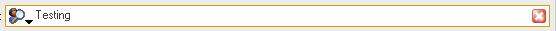

## WinXP Textbox Style With Firefox Like Buttons 1\.1

### Description

A textbox with XP Style + Firefox ClearText and Icon buttons. When the control got the focus, it changes the border color. When you click the close button, its clear the text. With the ArrowClick and IconClick events, you can make what you think! Have the CloseClick event too. You can change the icon with some icon on your disk or other control that have the .picture property. Have AutoSelect. If you set the AutoTab = True, when Len(.Text) = .MaxLenght, the control gives the focus to the next control in tabindex. RoundCorners Property. When you set .Enabled = False, the text and the background don't change color to gray! CloseButton, the Arrow and the Icon have individuals tooltips. If .EnterGotoNextTab = True, when you press key 13 (Enter), the focus is given to the next control in tabindex.

----

New features:

* The x button and the Icon have individual .Visible Property, so the textbox can have the both, only one of them, or none.

* Align, Alignment, Passwordchar, BorderStyle Property.

* ColorBack, ColorArrow, ColorText, ColorBorder Property

* OnFocusColorText, OnFocusFont, FocusColorBorder, OnFocusBorderStyle

* Some bugs fixed

* Common Events + ArrowClick, ClearClick, IconClick, MouseEnter and MouseLeave

* InputType (None, Letters, Numbers, Numbers and Letters, Custom)

* CharSet (LowerCase, UpperCase and ProperCase)

I hope that you can enjoy!
 
### More Info
 

             |
---                |---
**Submitted On**   |2006-05-07 18:00:02
**By**             |[Dirceu Moraes Resende Filho](https://github.com/Planet-Source-Code/PSCIndex/blob/master/ByAuthor/dirceu-moraes-resende-filho.md)
**Level**          |Beginner
**User Rating**    |5.0 (35 globes from 7 users)
**Compatibility**  |VB 6\.0
**Category**       |[Custom Controls/ Forms/  Menus](https://github.com/Planet-Source-Code/PSCIndex/blob/master/ByCategory/custom-controls-forms-menus__1-4.md)
**World**          |[Visual Basic](https://github.com/Planet-Source-Code/PSCIndex/blob/master/ByWorld/visual-basic.md)
**Archive File**   |[WinXP\_Text199266572006\.zip](https://github.com/Planet-Source-Code/dirceu-moraes-resende-filho-winxp-textbox-style-with-firefox-like-buttons-1-1__1-65132/archive/master.zip)

